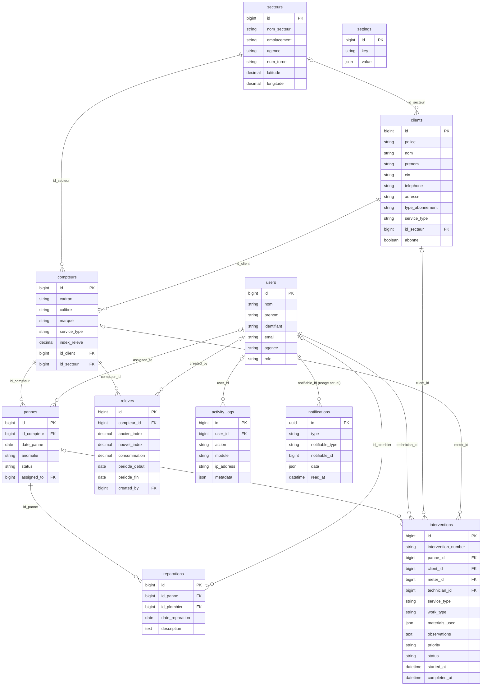

```plantuml
@startuml
left to right direction
skinparam packageStyle rectangle

actor "directeur" as Directeur
actor "responsable" as Responsable
actor "manager" as Manager
actor "technician" as Technician
actor "viewer" as Viewer
actor "developer" as Developer

usecase "Se connecter" as UC_Login
usecase "Se deconnecter" as UC_Logout
usecase "Consulter tableau de bord" as UC_Dashboard
usecase "Consulter donnees metier" as UC_ReadData
usecase "Consulter notifications" as UC_Notifications
usecase "Marquer notifications comme lues" as UC_ReadNotifications
usecase "Gerer clients" as UC_Clients
usecase "Gerer compteurs" as UC_Compteurs
usecase "Gerer secteurs" as UC_Secteurs
usecase "Creer une panne" as UC_CreatePanne
usecase "Mettre a jour une panne" as UC_UpdatePanne
usecase "Supprimer clients / compteurs /\nsecteurs / pannes / reparations" as UC_DeleteData
usecase "Creer / modifier une reparation" as UC_Repair
usecase "Creer / modifier une intervention" as UC_Intervention
usecase "Creer / modifier un releve" as UC_Releve
usecase "Telecharger rapports PDF / Excel" as UC_Reports
usecase "Gerer utilisateurs" as UC_Users
usecase "Gerer parametres" as UC_Settings
usecase "Consulter journal d'activite" as UC_Logs
usecase "Vider les tokens API" as UC_ClearTokens

Directeur --> UC_Login
Directeur --> UC_Logout
Directeur --> UC_Dashboard
Directeur --> UC_ReadData
Directeur --> UC_Notifications
Directeur --> UC_ReadNotifications
Directeur --> UC_Clients
Directeur --> UC_Compteurs
Directeur --> UC_Secteurs
Directeur --> UC_CreatePanne
Directeur --> UC_UpdatePanne
Directeur --> UC_DeleteData
Directeur --> UC_Repair
Directeur --> UC_Intervention
Directeur --> UC_Releve
Directeur --> UC_Reports
Directeur --> UC_Users
Directeur --> UC_Settings
Directeur --> UC_Logs
Directeur --> UC_ClearTokens

Responsable --> UC_Login
Responsable --> UC_Logout
Responsable --> UC_Dashboard
Responsable --> UC_ReadData
Responsable --> UC_Notifications
Responsable --> UC_ReadNotifications
Responsable --> UC_Clients
Responsable --> UC_Compteurs
Responsable --> UC_Secteurs
Responsable --> UC_CreatePanne
Responsable --> UC_UpdatePanne
Responsable --> UC_DeleteData
Responsable --> UC_Repair
Responsable --> UC_Intervention
Responsable --> UC_Releve
Responsable --> UC_Reports

Manager --> UC_Login
Manager --> UC_Logout
Manager --> UC_Dashboard
Manager --> UC_ReadData
Manager --> UC_Notifications
Manager --> UC_ReadNotifications
Manager --> UC_Compteurs
Manager --> UC_CreatePanne
Manager --> UC_UpdatePanne
Manager --> UC_Repair
Manager --> UC_Intervention
Manager --> UC_Releve
Manager --> UC_Reports

Technician --> UC_Login
Technician --> UC_Logout
Technician --> UC_Dashboard
Technician --> UC_ReadData
Technician --> UC_Notifications
Technician --> UC_ReadNotifications
Technician --> UC_UpdatePanne
Technician --> UC_Repair
Technician --> UC_Intervention
Technician --> UC_Releve

Viewer --> UC_Login
Viewer --> UC_Logout
Viewer --> UC_Dashboard
Viewer --> UC_ReadData
Viewer --> UC_Notifications
Viewer --> UC_ReadNotifications

Developer --> UC_Login
Developer --> UC_Logout
Developer --> UC_Dashboard
Developer --> UC_ReadData
Developer --> UC_Notifications
Developer --> UC_ReadNotifications
Developer --> UC_Clients
Developer --> UC_Compteurs
Developer --> UC_Secteurs
Developer --> UC_CreatePanne
Developer --> UC_UpdatePanne
Developer --> UC_DeleteData
Developer --> UC_Repair
Developer --> UC_Intervention
Developer --> UC_Releve
Developer --> UC_Reports

note right of Directeur
  `directeur` passe tous les controles `role:*`
  dans `EnsureUserHasRole`.
end note

note right of Developer
  Role technique.
  Desactive en production.
end note

note bottom of UC_UpdatePanne
  `technician`:
  - seulement sur ses pannes assignees
  - en pratique, le controller limite surtout `status`
end note

note bottom of UC_ReadData
  `technician`:
  acces scope par affectation,
  releves crees et secteurs lies.
end note
@enduml
```

```plantuml
@startuml
left to right direction
skinparam classAttributeIconSize 0
skinparam packageStyle rectangle
hide empty members

abstract class Authenticatable
abstract class Model
abstract class Controller

package "Models" {
  class User {
    +id: bigint
    +nom: string
    +prenom: string?
    +identifiant: string
    +email: string?
    +agence: string
    +role: UserRole
    +reparations()
    +interventions()
    +assignedPannes()
  }

  class Secteur {
    +id: bigint
    +nom_secteur: string
    +emplacement: string
    +agence: string
    +num_torne: string
    +latitude: decimal?
    +longitude: decimal?
    +compteurs()
    +pannes()
  }

  class Client {
    +id: bigint
    +police: string
    +nom: string
    +prenom: string?
    +cin: string?
    +telephone: string?
    +adresse: string?
    +type_abonnement: string
    +service_type: string
    +id_secteur: bigint?
    +abonne: bool
    +compteurs()
    +secteur()
  }

  class Compteur {
    +id: bigint
    +cadran: string
    +calibre: string
    +marque: string?
    +service_type: string
    +index_releve: decimal
    +id_client: bigint
    +id_secteur: bigint
    +client()
    +secteur()
    +pannes()
    +releves()
  }

  class Panne {
    +id: bigint
    +id_compteur: bigint
    +date_panne: date
    +anomalie: PanneAnomalie
    +status: PanneStatus
    +assigned_to: bigint?
    +compteur()
    +reparations()
    +interventions()
    +assignedOperator()
  }

  class Reparation {
    +id: bigint
    +id_panne: bigint
    +id_plombier: bigint?
    +date_reparation: date
    +description: text?
    +panne()
    +plombier()
  }

  class Releve {
    +id: bigint
    +compteur_id: bigint
    +ancien_index: decimal
    +nouvel_index: decimal
    +consommation: decimal
    +periode_debut: date
    +periode_fin: date
    +created_by: bigint?
    +compteur()
    +creator()
  }

  class Intervention {
    +id: bigint
    +intervention_number: string
    +panne_id: bigint?
    +client_id: bigint?
    +meter_id: bigint?
    +technician_id: bigint
    +service_type: string
    +work_type: string
    +materials_used: array?
    +observations: text?
    +priority: string
    +status: string
    +started_at: datetime
    +completed_at: datetime?
    +panne()
    +technician()
    +client()
    +meter()
  }

  class Setting {
    +id: bigint
    +key: string
    +value: json
  }

  class ActivityLog {
    +id: bigint
    +user_id: bigint?
    +action: string
    +module: string
    +ip_address: string?
    +metadata: json?
    +user()
    +record(action, module, request, metadata)
  }

  class DatabaseNotification {
    +id: uuid
    +type: string
    +data: json
    +read_at: datetime?
    +created_at: datetime?
  }
}

package "Services / Policies / Requests" {
  class NotificationService {
    +panneAssigned(panne)
    +repairCompleted(reparation)
    +userCreated(user)
  }

  class OperatorAccess {
    +isOperator(user)
    +scopePannes(query, user)
    +scopeReparations(query, user)
    +scopeReleves(query, user)
    +scopeCompteurs(query, user)
    +scopeClients(query, user)
    +canAccessCompteur(compteur, user)
  }

  class InterventionPolicy {
    +viewAny(user)
    +view(user, intervention)
    +create(user)
    +update(user, intervention)
  }

  class ReparationRequest {
    +authorize()
    +rules()
    +withValidator()
  }
}

package "Controllers" {
  class AuthController {
    +login(request)
    +logout(request)
    +me(request)
    +clearTokens()
  }

  class DashboardController {
    +summary()
  }

  class NotificationController {
    +index(request)
    +markAsRead(request)
  }

  class ClientController {
    +index(request)
    +store(request)
    +show(request, client)
    +update(request, client)
    +destroy(client)
  }

  class PanneController {
    +index(request)
    +store(request, notifications)
    +show(request, panne)
    +update(request, panne, notifications)
    +destroy(panne)
  }

  class ReparationController {
    +index(request)
    +store(request, notifications)
    +show(request, reparation)
    +update(request, reparation, notifications)
    +destroy(reparation)
  }

  class ReleveController {
    +index(request)
    +store(request)
    +update(request, releve)
    +show(request, releve)
  }

  class InterventionController {
    +index(request, policy)
    +store(request, policy)
    +show(request, intervention, policy)
    +update(request, intervention, policy)
  }

  class UserController {
    +index(request)
    +technicians()
    +store(request, notifications)
    +update(request, user)
  }

  class SettingsController {
    +show()
    +update(request)
  }

  class ReportController {
    +pannesPdf(request)
    +clientsExcel()
  }

  class ClientsCompteursExport {
    +collection()
    +headings()
    +map(row)
    +title()
  }
}

User --|> Authenticatable
Secteur --|> Model
Client --|> Model
Compteur --|> Model
Panne --|> Model
Reparation --|> Model
Releve --|> Model
Intervention --|> Model
Setting --|> Model
ActivityLog --|> Model

AuthController --|> Controller
DashboardController --|> Controller
NotificationController --|> Controller
ClientController --|> Controller
PanneController --|> Controller
ReparationController --|> Controller
ReleveController --|> Controller
InterventionController --|> Controller
UserController --|> Controller
SettingsController --|> Controller
ReportController --|> Controller

Client "0..*" --> "0..1" Secteur : secteur
Secteur "1" <-- "0..*" Compteur : compteurs
Client "1" <-- "0..*" Compteur : client
Compteur "1" <-- "0..*" Panne : compteur
Panne "0..*" --> "0..1" User : assignedOperator
Panne "1" <-- "0..*" Reparation : panne
Reparation "0..*" --> "0..1" User : plombier
Compteur "1" <-- "0..*" Releve : compteur
Releve "0..*" --> "0..1" User : creator
Panne "0..1" <-- "0..*" Intervention : panne
User "1" <-- "0..*" Intervention : technician
Client "0..1" <-- "0..*" Intervention : client
Compteur "0..1" <-- "0..*" Intervention : meter
User "0..1" <-- "0..*" ActivityLog : user
User "1" <-- "0..*" DatabaseNotification : notifications

NotificationService ..> Panne
NotificationService ..> Reparation
NotificationService ..> User
NotificationService ..> DatabaseNotification

OperatorAccess ..> User
OperatorAccess ..> Compteur
OperatorAccess ..> Panne
OperatorAccess ..> Reparation
OperatorAccess ..> Releve
OperatorAccess ..> Client

InterventionPolicy ..> User
InterventionPolicy ..> Intervention

ReparationRequest ..> Panne
ReparationRequest ..> Reparation
ReparationRequest ..> User

AuthController ..> User
AuthController ..> ActivityLog
DashboardController ..> Client
DashboardController ..> Compteur
DashboardController ..> Secteur
DashboardController ..> Panne
DashboardController ..> Intervention
NotificationController ..> DatabaseNotification
NotificationController ..> User
ClientController ..> Client
ClientController ..> Secteur
ClientController ..> OperatorAccess
PanneController ..> Panne
PanneController ..> NotificationService
ReparationController ..> Reparation
ReparationController ..> Panne
ReparationController ..> ReparationRequest
ReparationController ..> NotificationService
ReparationController ..> OperatorAccess
ReleveController ..> Releve
ReleveController ..> Compteur
ReleveController ..> OperatorAccess
InterventionController ..> Intervention
InterventionController ..> Panne
InterventionController ..> ActivityLog
InterventionController ..> InterventionPolicy
InterventionController ..> OperatorAccess
UserController ..> User
UserController ..> NotificationService
UserController ..> ActivityLog
SettingsController ..> Setting
SettingsController ..> ActivityLog
ReportController ..> Panne
ReportController ..> ClientsCompteursExport

note bottom of ReparationRequest
  Une seule reparation active par panne
  est imposee par validation applicative,
  pas par une contrainte SQL unique.
end note

note bottom of DatabaseNotification
  Table Laravel `notifications`.
  Utilisation actuelle: notifications utilisateur.
end note
@enduml
```

# Documentation UML basee sur le code reel

Documentation reconstruite uniquement a partir du code:

- `backend/routes/api.php`
- `backend/app/Models/*`
- `backend/app/Http/Controllers/*`
- `backend/app/Http/Middleware/EnsureUserHasRole.php`
- `backend/app/Policies/InterventionPolicy.php`
- `backend/app/Services/NotificationService.php`
- `backend/app/Support/OperatorAccess.php`
- `backend/app/Http/Requests/ReparationRequest.php`
- `backend/database/migrations/*`
- `frontend/src/App.jsx`
- `frontend/src/utils/rbac.js`
- `frontend/src/pages/*`
- `frontend/src/dashboards/*`

Quand une regle existe dans le code applicatif mais pas dans une contrainte SQL, elle est signalee.

## 1. Diagramme de cas d'utilisation UML

### Acteurs reels trouves

- `directeur`
- `responsable`
- `manager`
- `technician`
- `viewer`
- `developer` : role technique, desactive en production

### Fonctionnalites par acteur

- `directeur`
  - acces global via `EnsureUserHasRole`
  - gestion des utilisateurs
  - gestion des parametres
  - consultation du journal d'activite
  - suppression de tous les tokens API
  - acces aux operations metier

- `responsable`
  - tableau de bord complet
  - consultation des donnees metier
  - notifications
  - gestion de `clients`, `compteurs`, `secteurs`, `pannes`, `reparations`, `interventions`, `releves`
  - suppression de `clients`, `compteurs`, `secteurs`, `pannes`, `reparations`
  - export PDF / Excel

- `manager`
  - tableau de bord complet
  - consultation des donnees metier
  - notifications
  - gestion de `compteurs`
  - creation et mise a jour de `pannes`
  - creation et mise a jour de `reparations`, `interventions`, `releves`
  - export PDF / Excel

- `technician`
  - tableau de bord operationnel
  - consultation limitee par affectation / secteur / tache
  - notifications
  - mise a jour de `pannes` assignees
  - creation et mise a jour de `reparations`, `interventions`, `releves`

- `viewer`
  - tableau de bord lecture seule
  - consultation des donnees metier
  - notifications

- `developer`
  - role technique non production
  - comportement proche du `responsable` sur les modules metier
  - pas d'administration `directeur` trouvee dans les routes

### PlantUML

### Explication courte

Le projet gere des operations techniques par role. `directeur` est un super-role cote API. `responsable` couvre presque tout le metier. `manager` supervise sans suppression. `technician` travaille sur les elements affectes. `viewer` reste en lecture seule. `developer` est un role technique reserve au non-production.

### Points a confirmer

- Le frontend declare une route `/viewer/reports`, mais l'API `reports/*` est protegee par `managerRoles` dans `backend/routes/api.php`.
- Je n'ai donc pas documente les rapports comme une capacite `viewer` confirmee.

## 2. MCD

### Entites principales

- `users`
  - `id`, `nom`, `prenom`, `identifiant`, `email`, `agence`, `password`, `role`

- `secteurs`
  - `id`, `nom_secteur`, `emplacement`, `agence`, `num_torne`, `latitude`, `longitude`

- `clients`
  - `id`, `police`, `nom`, `prenom`, `cin`, `telephone`, `adresse`, `type_abonnement`, `service_type`, `id_secteur`, `abonne`

- `compteurs`
  - `id`, `cadran`, `calibre`, `marque`, `service_type`, `index_releve`, `id_client`, `id_secteur`

- `pannes`
  - `id`, `id_compteur`, `date_panne`, `anomalie`, `status`, `assigned_to`

- `reparations`
  - `id`, `id_panne`, `id_plombier`, `date_reparation`, `description`

- `releves`
  - `id`, `compteur_id`, `ancien_index`, `nouvel_index`, `consommation`, `periode_debut`, `periode_fin`, `created_by`

- `interventions`
  - `id`, `intervention_number`, `panne_id`, `client_id`, `meter_id`, `technician_id`, `service_type`, `work_type`, `materials_used`, `observations`, `priority`, `status`, `started_at`, `completed_at`

- `activity_logs`
  - `id`, `user_id`, `action`, `module`, `ip_address`, `metadata`

- `settings`
  - `id`, `key`, `value`

- `notifications`
  - `id`, `type`, `notifiable_type`, `notifiable_id`, `data`, `read_at`
  - table Laravel actuelle; `App\\Models\\Notification` semble legacy et est a confirmer

### Associations et cardinalites

- `secteurs` `0,N` - `clients` `0,1`
- `secteurs` `0,N` - `compteurs` `1,1`
- `clients` `0,N` - `compteurs` `1,1`
- `compteurs` `0,N` - `pannes` `1,1`
- `users` `0,N` - `pannes` `0,1` via `assigned_to`
- `pannes` `0,N` - `reparations` `1,1`
- `users` `0,N` - `reparations` `0,1` via `id_plombier`
- `compteurs` `0,N` - `releves` `1,1`
- `users` `0,N` - `releves` `0,1` via `created_by`
- `pannes` `0,N` - `interventions` `0,1`
- `users` `0,N` - `interventions` `1,1` via `technician_id`
- `clients` `0,N` - `interventions` `0,1`
- `compteurs` `0,N` - `interventions` `0,1`
- `users` `0,N` - `activity_logs` `0,1`
- `users` `0,N` - `notifications` `1,1` en usage actuel

### Points a confirmer

- `pannes` -> `reparations`
  - le modele et la base autorisent `0,N`
  - mais `ReparationRequest` impose une seule reparation active par panne
  - la cardinalite metier active est donc plutot `0,1`

- `notifications`
  - le controller utilise `Illuminate\\Notifications\\DatabaseNotification`
  - la classe locale `App\\Models\\Notification` ne correspond plus a la table Laravel actuelle

### Mermaid ER

## 3. Diagramme de classes UML

### Classes principales retenues

- Modeles metier: `User`, `Secteur`, `Client`, `Compteur`, `Panne`, `Reparation`, `Releve`, `Intervention`, `Setting`, `ActivityLog`
- Services / regles: `NotificationService`, `OperatorAccess`, `InterventionPolicy`, `ReparationRequest`
- Controllers clefs: `AuthController`, `DashboardController`, `NotificationController`, `ClientController`, `PanneController`, `ReparationController`, `ReleveController`, `InterventionController`, `UserController`, `SettingsController`, `ReportController`

### PlantUML

### Explication courte

Le diagramme de classes montre trois couches:

- les modeles metier Laravel
- les services / policies / requests qui portent les regles
- les controllers qui exposent les cas d'usage API

Le coeur metier est centre sur `Compteur`, `Panne` et `Intervention`. L'administration systeme s'appuie surtout sur `User`, `Setting` et `ActivityLog`.
